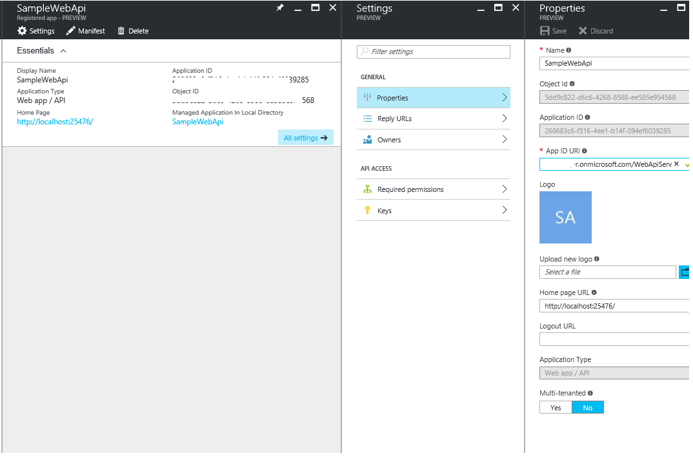
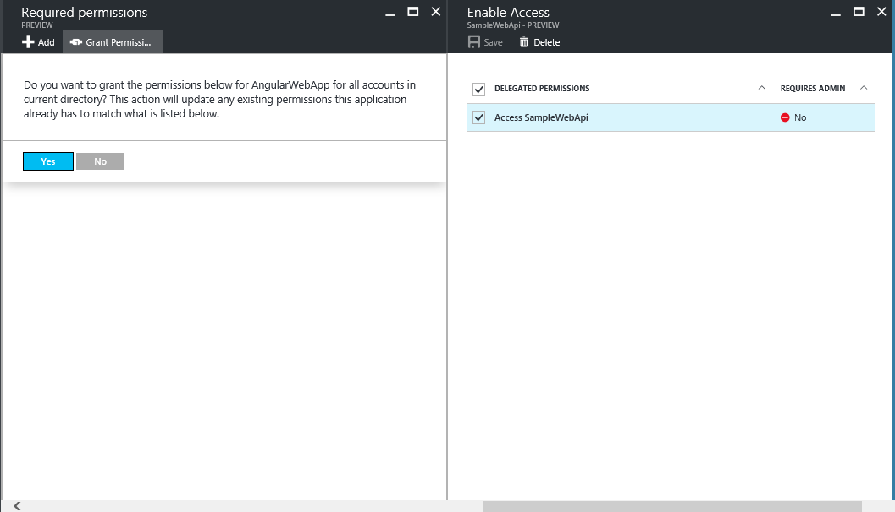
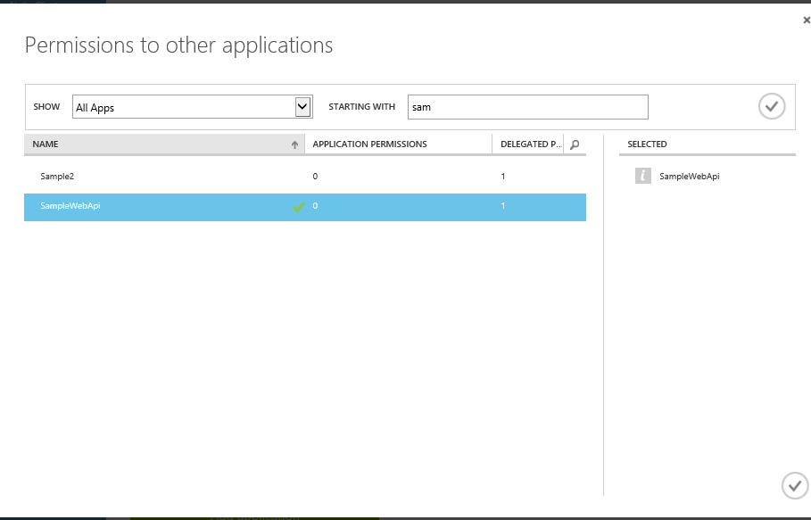
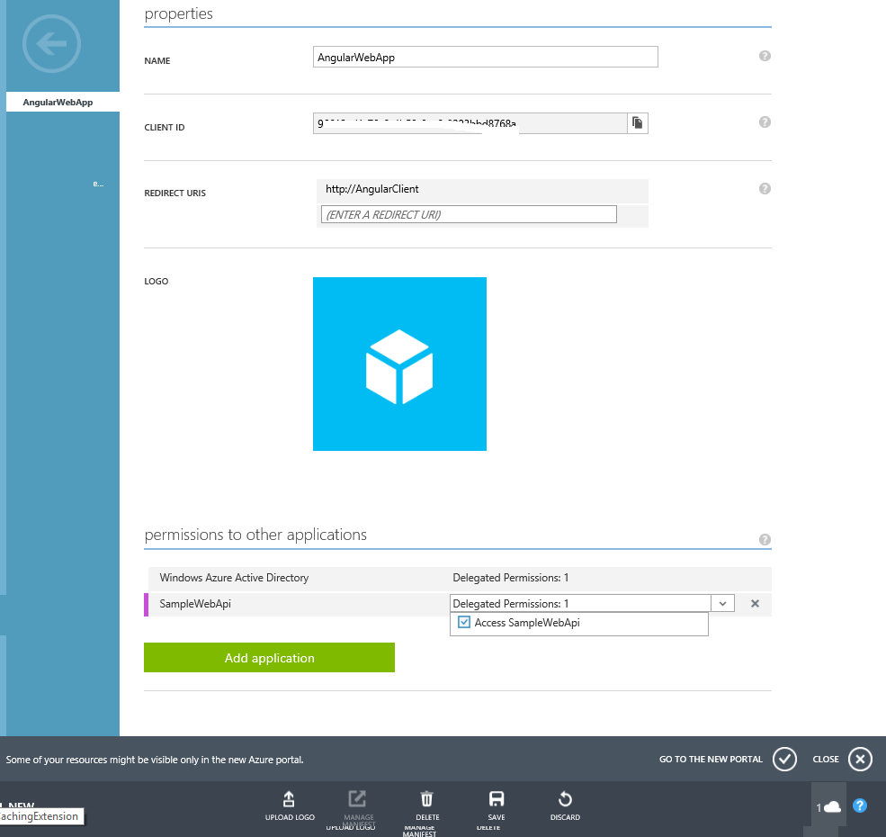
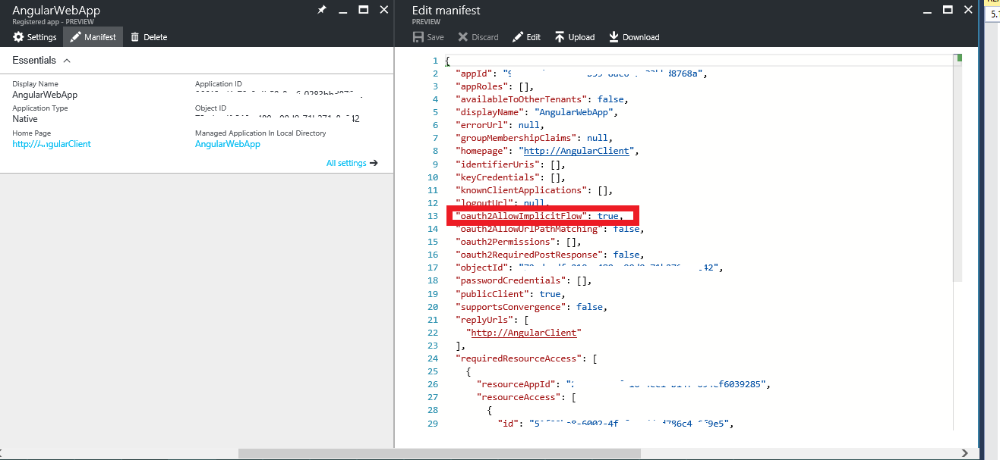

# ng2AzureAD
   This Project uses Angular 2 Js Client and 
   .Net Web API Server Authenticated with Azure AD

# Prerequisities

 - Visual Studio 2015
 - An Azure subscription
 - Create Azure AD from your azure subscriptions. 

# Step 1: Clone or download this repository

From your Visual studio or command line: git clone https://github.com/karthikeyanVK/ng2AzureAD.git

# Step 2: Setup Web API Application in Azure AD

1.  Sign in to the [Azure portal](https://portal.azure.com).
2.  On the top bar, click on your account and under the **Directory** list, choose the Active Directory tenant where you wish to register your application.
  
3.  Click on **More Services** in the left hand nav, and choose **Azure Active Directory**.
4.  Click on **App registrations** and choose **Add**.
  
5.  Name the application, eg:. 'SampleWebAPI' and select 
  'Web Application and/or Web API' as the Application Type. For the sign-on URL, 
  as `https://localhost:25476`.

6.  Click on **Create** to create the application.
7.  Navigate to the SampleWebAPI and then change  APP ID URI, enter https://<your_tenant_name>/TodoListService,
     replacing **<your_tenant_name>** with the name of your Azure AD tenant. We will use https://contoso.onmicrosoft.com/TodoListService
        
8.   Save the Changes

# Step 3: Setup Angular 2 Application in Azure AD

1. Click on **App registrations** and choose **Add**.
  
2.  Enter a name for the application, eg:. 'AngularWebAPP' and select 
  'Web Application and/or Web API' as the Application Type. For the sign-on URL, 
  enter the base URL for the sample, which is by default `https://localhost:4200`.

3.  Click on **Create** to create the application.
4.  Navigate to the SampleWebAPI and then change the APP ID URI, enter https://<your_tenant_name>/TodoListService,
     replacing **<your_tenant_name>** with the name of your Azure AD tenant. We will use https://contoso.onmicrosoft.com/TodoListService
        
5.   Save the Changes
6.   While still in the Azure portal, choose your application, click on **Settings** and choose **Properties**.
7.   Find the Application ID value and copy it to the clipboard.
8.   Configure Permissions for your application - in the Settings menu, choose the 'Required permissions' section, click on **Add**, then **Select an API**, and type "SampleWebAPI" in the text box. Then, click on  **Select Permissions** and select 'Access SampleWebAPI'
9.   Grant permissions across your tenant for your application. Go to Settings -> Properties -> Required Permissions, and click on the **Grant Permissions** button in the top bar. Click **Yes** to confirm.
 

 Alternatively you can use old portal to give permission find the application in the directory -> Click on Add Application -> Search and then add delegated permissions as below.

 ## Step 5:  Enable the OAuth2 implicit grant for Angular APP application

 1.  While still in the Azure portal, In your application page, click on **Manifest** to open the inline manifest editor. 
 2.  Change `oauth2AllowImplicitFlow` property to `true` as below, by default it will be false.
  
 3. Save the changes

## Step 6: Configure Web.Config of Web API Application

1. Open the `ng2-ADWebAPI` application in Visual Studio 2015
2. Rename the `Web.template.config` as `Web.config`
3. Change the app key of `Tenant` with AAD Tenant name in our case `contoso.onmicrosoft.com`
4. Change the app key of `Audience` with Tenant name in our case 'https://contoso.onmicrosoft.com/TodoListService'

## Step 7: Configure Angular 2 APP

 

